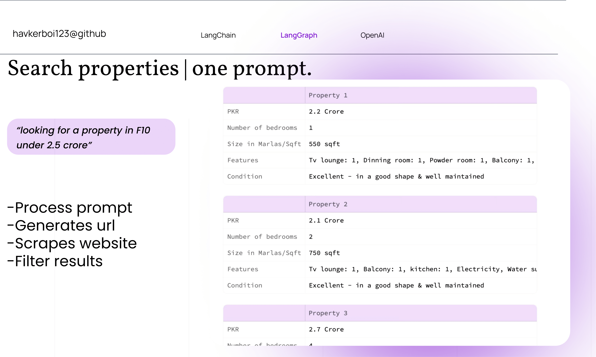

# Search properties with one prompt



Developed to get hands on  with Langchain and LangGraph , designed to help users find their ideal apartments in Pakistan!

## How does it work?


The user entered prompt is processed using OpenAI functions with a proper schema that extracts information like location (city and area), budget, size and bedrooms etc.

```python
"properties": {
                    "city": {
                        "type": "string",
                        "description": "The city where the apartment is located."
                    },
                    "area": {
                        "type": "string",
                        "description": "The area within the city where the apartment is located. User might input more than one preferred area, separated by a comma."
                    },
                    "apartment_type": {
                        "type": "string",
                        "description": "The type of apartment (e.g., studio, 1BHK, 2BHK, etc.)."
                    },
                    "budget": {
                        "type": "number",
                        "description": "The budget for buying the apartment."
                    },
                    "number_of_bedrooms": {
                        "type": "string",
                        "description": "Number of bedrooms"
                    },
                    "size": {
                        "type": "string",
                        "description": "Size of the apartment needed , in marlas. i.e 2 Marla , 3 Marla"
                    },
                    "number_of_bathrooms": {
                        "type": "string",
                        "description": "Number of bathrooms"
                    }
                },
```


The processed information is passed to an LLM call that curates the specific url leading to the respective page of an online real-estate site:
```bash
"https://www.graana.com/sale/residential-properties-sale-f-11-islamabad-1-240/?page=1&maxPrice=30000000&maxSize=&sizeUnit=Marla&bed="
```

If the user for example had entered a prompt :

```bash
"Need apartments under 20 mil in f10/f11"
```
The pipeline would generate two different links leading to two different web pages i.e one link for 'f10' area and the other for 'f11' area.


From there , using LangChain schematic web scrapping with playwright the entire page link's are scrapped.


These scrapped links are scanned for the property listing links and passed on further into the pipeline.

Each of these links is then scrapped using LangChain again to extract needed information.


## LangGraph functionality 
LangGraph is used in this project to manage the workflow of the apartment finder assistant. It defines a state graph with nodes representing different stages of processing user input, such as checking if the input contains necessary details like the city name (identify_type), asking for more details if needed (ask_for_details), and proceeding with the user request (does_not_need_details). Conditional edges control the flow between these stages based on the output of the language model's decision, ensuring a structured and efficient processing pipeline for user queries.

##  Libraries used
LangChain
LangGraph
OpenAI
Streamlit
Playwright
Pandas
Numpy


